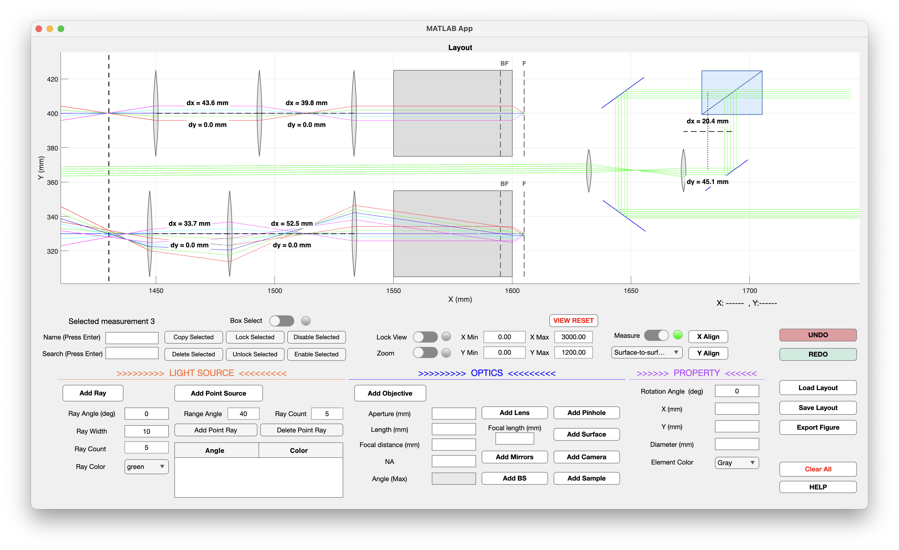

# COSMIC-OptiLayout
An optical layout design tool for research laboratories.
# COSMIC OptiLayout

An interactive optical layout design software developed in MATLAB for research laboratories.



---

## Features

- Interactive optical layout editor
- Real-time 2D ray tracing
- Parallel beam source with adjustable beam width, angle, ray count, and color
- Point source with customizable emission angles and ray colors
- Optical elements including:
  - Thin lens
  - Objective
  - Mirror
  - Beam splitter
  - Pinhole
  - Surface
- Adjustable optical element properties (position, rotation, size, focal length, numerical aperture, etc.)
- Interactive drag-and-drop editing
- Box selection and multi-element editing
- Distance measurement tool
- Save and load optical layouts
- Undo / Redo
- Zoom and pan navigation
- Cross-platform source code (MATLAB App Designer)

---

## Installation

### macOS

Download the latest version from the **Releases** page.

If macOS reports that the installer is damaged, open **Terminal** and run:

```bash
xattr -dr com.apple.quarantine "/path/to/MyAppInstaller_mcr.app"
```

Then launch the installer again.

### Windows

Windows version is under development.

---

## Source Code

This project is developed with **MATLAB App Designer (R2024a)**.

---

## License

MIT License.

---

## Author

**Shuang Liang**

Department of Physics and Astronomy  
University of Pittsburgh
